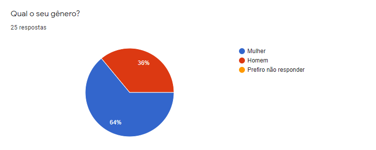
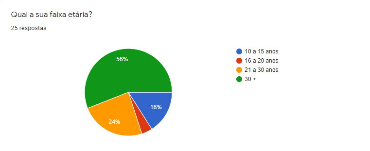
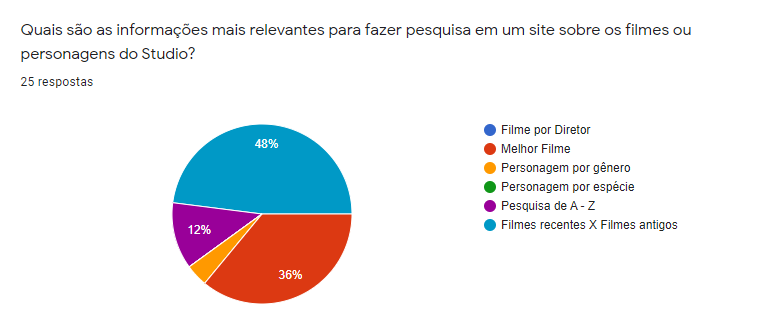
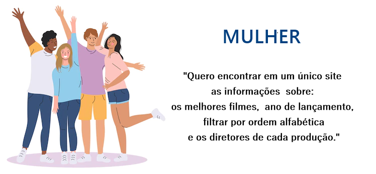
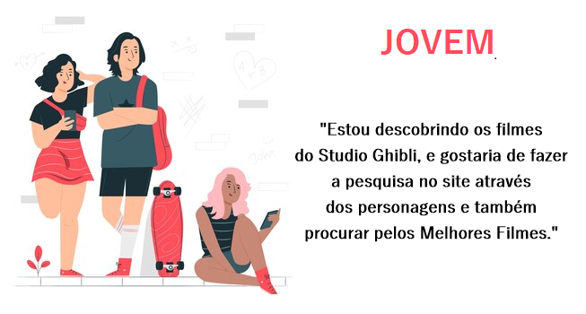
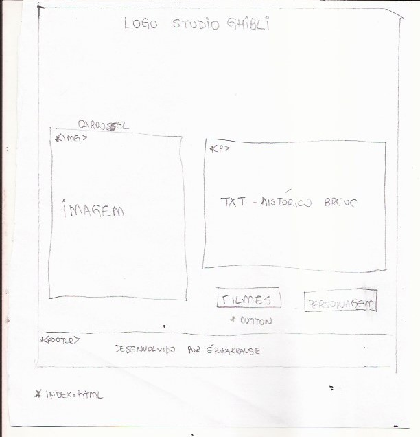
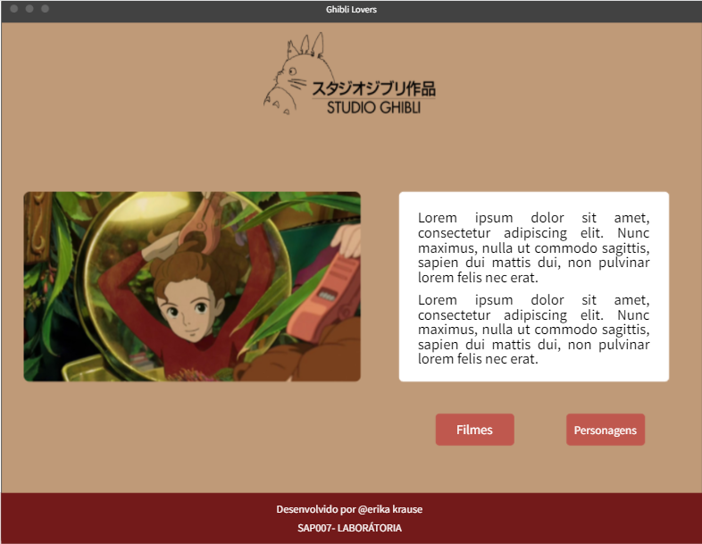
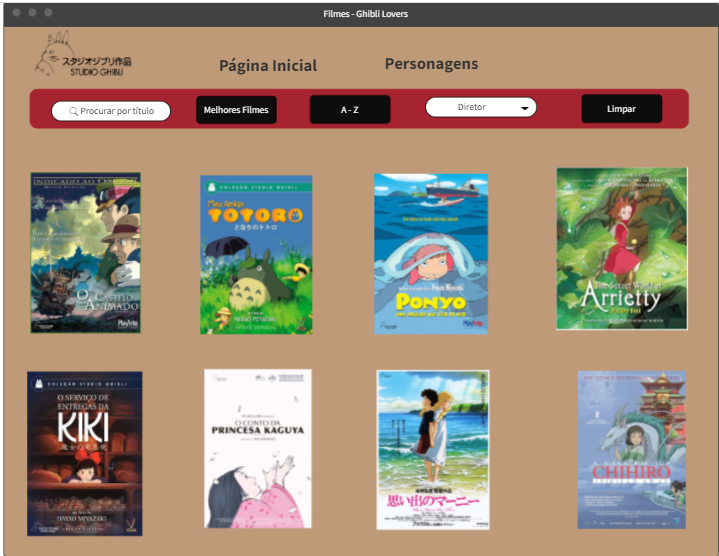
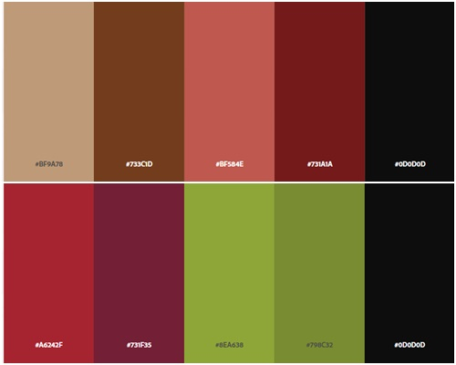

# Data Lovers

 ---

## Índice

- [1. Preâmbulo](#1-preâmbulo)
- [2. Resumo do projeto](#2-resumo-do-projeto)
- [3. Pesquisa](#3-pesquisa)
- [4. Histórias de usuários](#4-historias-de-usuarios)
- [5. Protótipos](#5-prototipos)
- [6. Teste de usabilidade](#6-teste-de-usabilidade)
- [7. Considerações finais](#7-considerações-finais)

---

## 1. Preâmbulo

Segundo a
[Forbes](https://www.forbes.com/sites/bernardmarr/2018/05/21/how-much-data-do-we-create-every-day-the-mind-blowing-stats-everyone-should-read)
90% dos dados que existem hoje foram gerados durante os últimos dois anos. A
cada dia geramos 2.5 milhões de terabytes de dados, uma cifra sem precedentes.

Apesar disso, os dados por si só são de pouca utilidade. Para que essas grandes
quantidades de dados se convertam em **informação** compreensível para os
usuários, precisamos entender e processar estes dados. Uma forma simples de
fazer isso é criando _interfaces_ e _visualizações_.

Na imagem seguinte, você pode ver como os dados que estão na parte esquerda
podem ser usados para construir a interface amigável e compreensível que está na
parte direita.

## 2. Resumo do projeto
Este é o segundo projeto desenvolvido para o Bootcamp de desenvolvimento frot-end da Laboratória Brasil, e consite em desenvolver uma aplicação para que o usuário interaja, busque, filtre, ordene e mostre algum valor referente a sua pesquisa através de um banco de dados.

### Definição de produto
O Studio Ghibli é um estudio de animação japonesa conhecido mundialmente.
Para este novo desafio optei por construir uma interação sobre o Studio Ghibli, onde o usuário poderá classificar suas pesquisa por título dos filmes, diretor,  ano de seu lançamento, nome dos personagens, gênero, porcentagem referente a produções realizadas por diretor e o gênero dos personagem.

### Pesquisa de mercado
Gráficos retirados da pesquisa realizada atráves da ferramenta _Google Forms_.  
64% dos entrevistados se declararam como mulher e estimasse que a sua faixa etária está entre 25 e +30 anos.
- Gênero dos entrebistados:

- Idade dos entrevistados:

A partir do gráfico contendo a pesquisa sobre as informações relevantes para realizar a pesquisa em nossa aplicação, podemos extrair as principais temáticas para montar as histórias de usuários. 

## 3. Histórias de usuário

**Historia 1**

**História 2**
 

## 4. Protótipo
#### Protótipo de baixa fidelidade

#### Protótipo de alta fidelidade
- Homepage

- Filtros e Cards (filmes e personagens)

## 6. Testes de usabilidade

A paleta de cores a ser utilizada será do filme The Secret World of Arrietty, e a análise de cores foram  extraidas do banner da homepage através da ferramenta _Adobe Color_. 
Foram feitos ajuste de layou desde o protótipo inicial para melhorar o fluxo de trabalho.
Inicialmente foi pensado em obter as informações relevantes dos cards através da manipulação de flip-card, mas foi optado por uma estrutura mais simples de ser visualizada pelo usuário.

.
 
## 7. Considerações finais
Neste projeto foram desenvolvidas as seguintes Atividades de Aprendizagem:
- HTML Semântico
- Manipulação de DOM
- Uso de condicionais
- Manipular Arrays e Objects
- ES Modules (export|import)
- Criar testes 
- Layout Responsivo
- Git e Github: comandos git, gerenciamento de repositório, github colarorativo (branch, pull request) 

### Ferramentas utilizadas:
- Vs Code
- Node.js
- Jest
- Mockflow
- Adobe Color
- Trello
